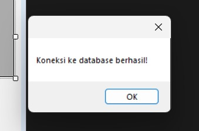
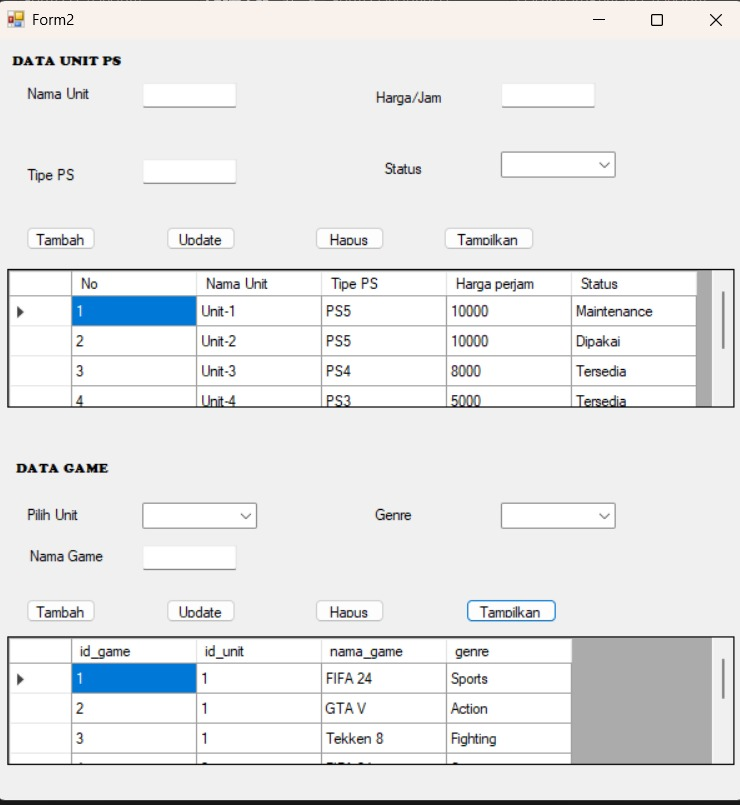
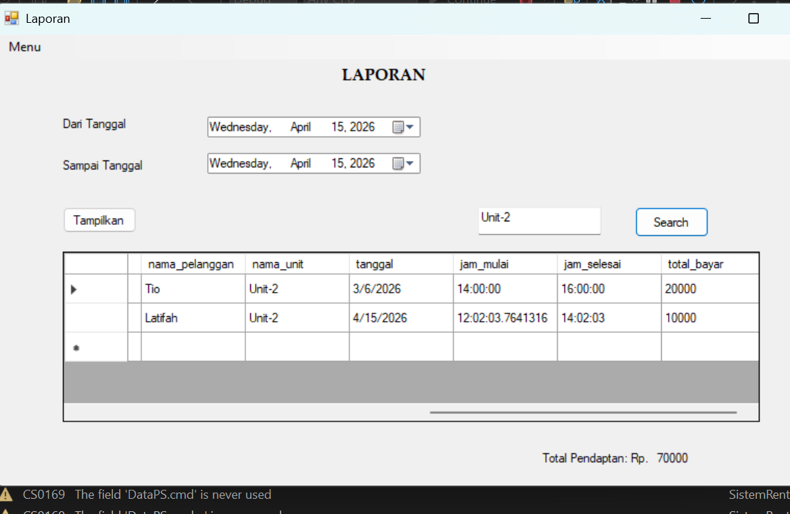
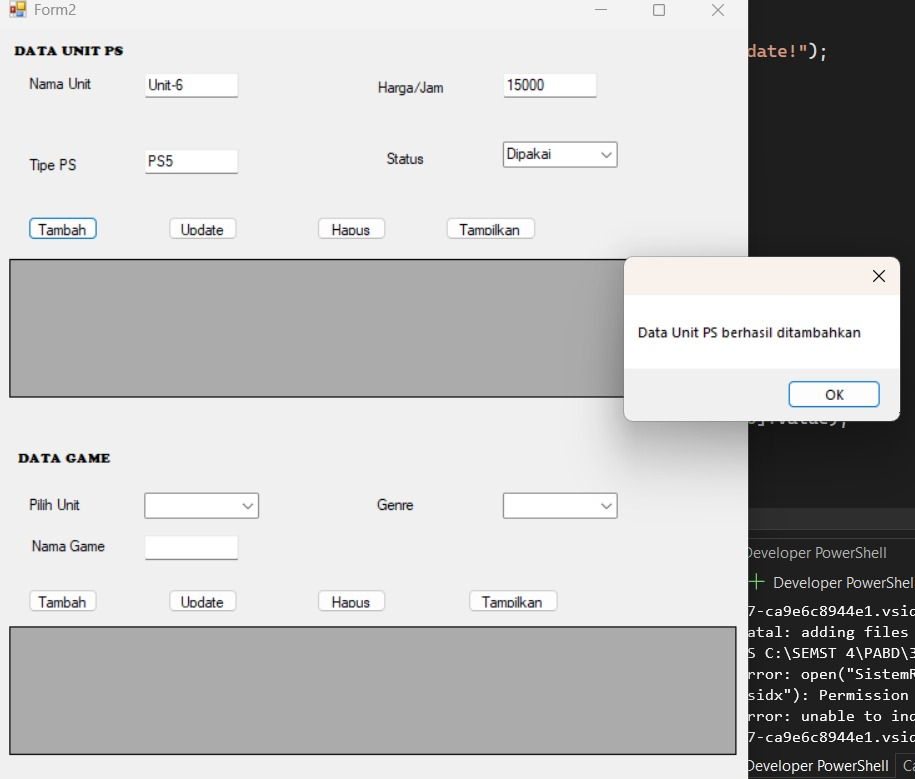
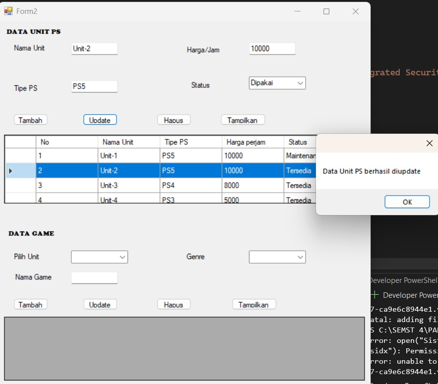
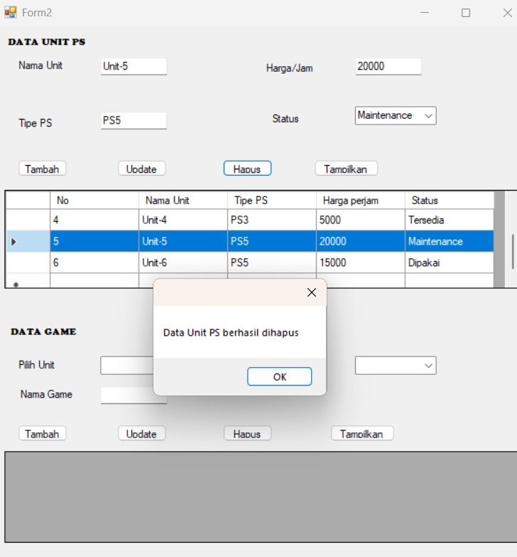

# Sistem Rental PS #
Project ini merupakan Sistem rental PlayStation berbasis C# dan SQL Server

## Simulasi SQL Injection
Disini admin sedang melakukan pengujian keamanan pada fitur Kelola Unit PS menggunakan tombol Test Injectio yang dimana awalnya admin memasukkan input normal pada textbox Tipe PS contohnya 'PS4' jika menggunakan query update biasa seperti ini ' UPDATE UnitPS 
SET nama_unit='HACKED' 
WHERE tipe_ps='PS4'' maka yang berubah hanya data unit dengan tipe PS4 yang berubah. Kemudian dilakukanlah simulasi SQL Injection Ketika admin memasukkan query ' OR 1=1 -- yang dimana query tersebut dibuat menggunakan penggabungan string langsung maka untuk simulasi SQL Injection query berubah menjadi UPDATE UnitPS 
SET nama_unit='HACKED' 
WHERE tipe_ps='' OR 1=1 --' karena kondisi 'OR 1=1 -- selalu bernilai True, sehingga seluruh data pada table UnitPS ikut terupdate dan nama Unit akan berubah menjadi "HACKED" maka hal ini menunjukkan bahwa penggunaan query tanpa adanya parameter sangat rentan terhadap serangan SQL Injection. Alasan mengapa kelompok saya tidak memilih form Transaksi sebgai simulasi SQL Injection karena table transaksi menyimpan data yang lebih penting dan sensitf. Jika terjadi SQL Injection pada bagian transaksi, maka data dapat rusak,berubah,atau bahkan terhapus secara keseluruhan. Selain itu, query di form Transaksi juga lebih kompleks kerena melibatkan beberapa proses sekaligus, seperti hitung Harga, hitung durasi bermain dari jam mulai hingga jam selesai. Hal tersebut membuat proses simulasi SQL Injection menjadi lebih sulit untuk diimplementasikan. Jadi karena itu kelompok kami memilih untuk mensimulasikan SQL Injection di form Kelola Unit PS karena strukturnya lebih sederhana.

##Tampilan Aplikasi

